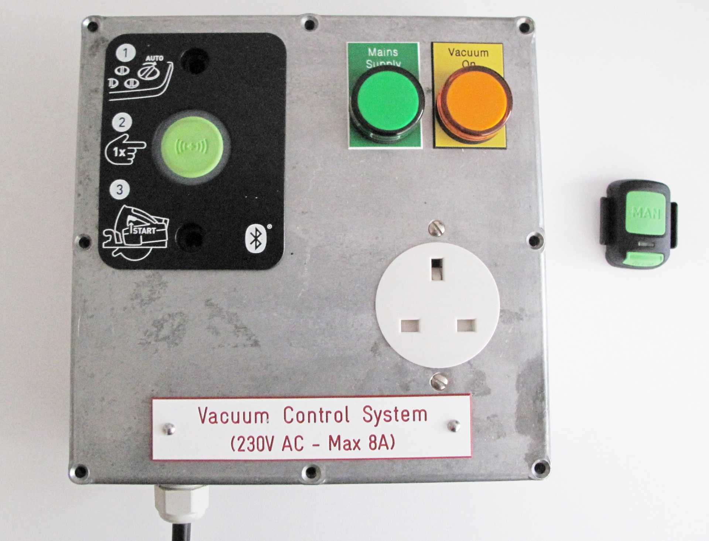
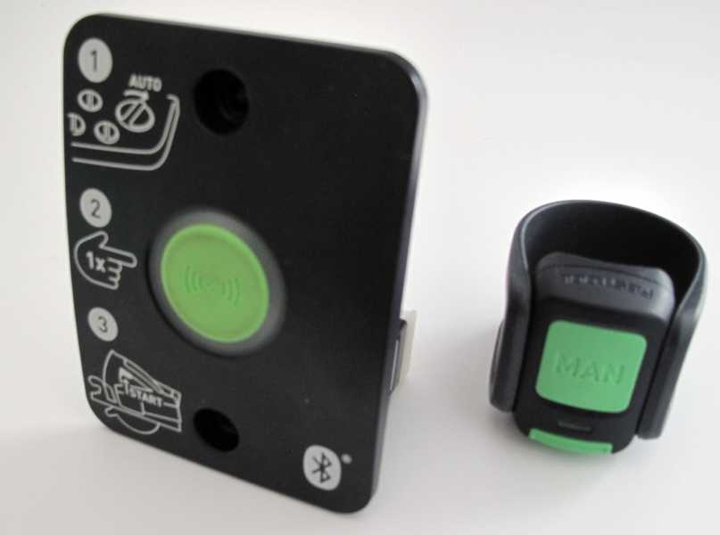
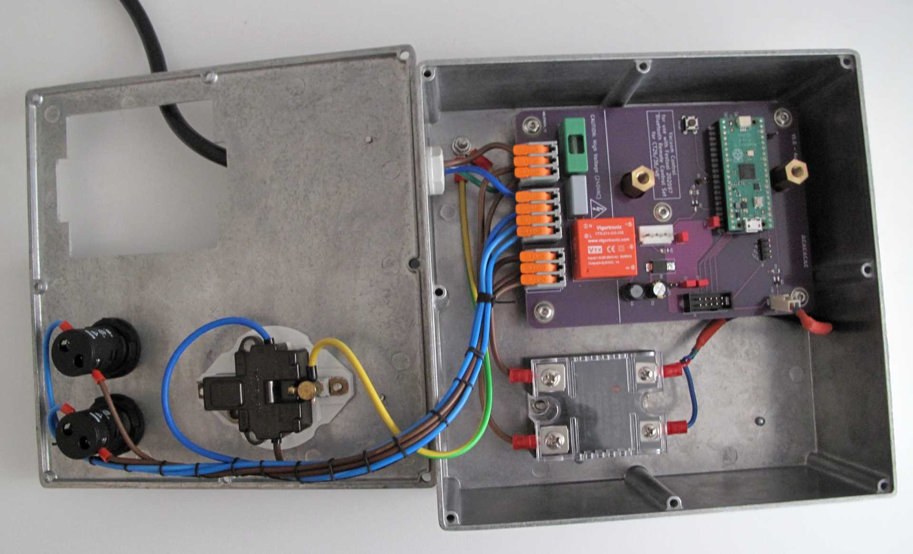
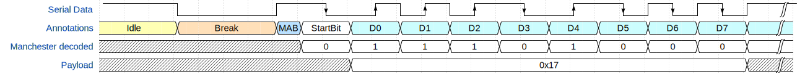
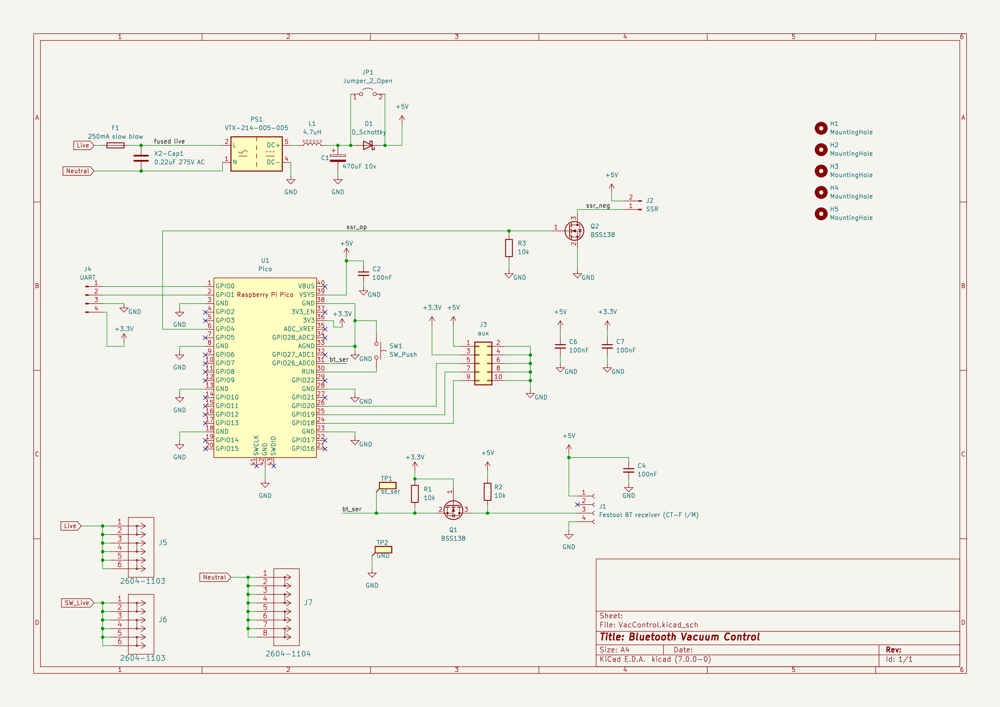

# Use a Festool Bluetooth remote control with any vacuum

Use the Festool Bluetooth remote with vacuum extractors from other manufactures.

The project contains the Schematics and PCB layout designed using [KiCad 7](https://www.kicad.org/), and the firmware (written in C) for the [Raspberry Pi Pico](https://www.raspberrypi.com/products/raspberry-pi-pico/) to interface with a [Festool No. 202097 Bluetooth Remote Control add-on](https://www.amazon.co.uk/Festool-202097-Remote-Control-Blue/dp/B0794ZWFLR)

Festool sell an upgrade for their CT26/36/48 vacuum extractors to give remote control using Bluetooth, CT-F I/M-Set. I has two parts, the "CT-F I/M" installs in the extractor and the "CT-F I" is the button that attaches to the end of the vacuum hose. The button then starts and stops extractor. Paired cordless tools with their bluetooth enabled batteries can also control the extractor.

But I don't have a CT26/36/48 extractor from Festool, so I wanted to create an adaptor that uses the module and controls a standard power socket to control any device attached. With a custom PCB, a Raspberry Pi Pico, some firmware, a Solid State Relay, and an enclosure I had a working solution.  Along the way I had to reverse engineer the nonstandard serial protocol and try to make sense of the bytes sent.  

## Features
 - Allow connecting any vacuum extractor that has a physical switch capable of being always on.  A vacuum with an NVR will not work. 
 - Works with an unmodified Festool No. 202097 receiver. It's Plug and Play. At a later date if I ever get a CT extractor I wanted to be able to use this module again.
 - Had software safety features; Automatically turns off if left on for an extended period.  Uses the RP2040's hardware watchdog to shut off the power if the software stops for any reason.
 - Should work with Festool cordless tools with their Bluetooth batteries (untested). 

## How it works
The Festool module has three electrical connections to the host vacuum, two for power and one is data. The data line is serial, probably bidirectional, and uses a form of Manchester encoding.  For more details on the serial stream and commands within see the [description of the traces](./software/traces/) captured with a logic analyzer.

The serial data from the receiver feeds the Raspberry Pi Pico via a BSS138 MOSFET as a level shifter.  The Pico decodes the Manchester encoded stream. When the Start/Stop commands are seen the software switches a Solid State Relay controlling mains AC supply to the output socket.

Wanting an excuse to learn KiCad, I designed a custom PCB to host the Pi Pico and a 4 pin 3.96 mm header to plug the CT-F I/M bluetooth module into.  The board contains a 240V switch mode regulator providing 5V DC power to both the Pico and the CT-F I/M.

## License
The software, schematic designs and PCB layout contained in this repository are released under the MIT license.

## Credits
I got the pinout for the Bluetooth receiver from YouTube channel "My Project Box". His video ["Festool Bluetooth Hack / Mod works with any dust extractor!"](https://www.youtube.com/watch?v=EyrakKOR5tI) shows a very neat solution with a different approach; avoiding any software.

On Github, user gilbertf published [libft](https://github.com/gilbertf/libft) capable of both sending and receiving. It's not used by this project but his encoder appears to send the same bytes my decoder expects, this gave me some confidence that the implementation here is somewhat interoperable.

I used the Pi Pico KiCAD symbol and footprint from [ncarandini/KiCad-RP-Pico](https://github.com/ncarandini/KiCad-RP-Pico)